# 헬스잇(HealthEat) 경구약제 객체검출 — 최종 리포트
> **LHK / Model Architect** · 기획 → 대회(캐글 [AI12]) → 상용화 설계 전체 여정 · 2026-07

**한 줄 요약 — "점수를 올리기 전에, 점수를 믿을 수 있게."**
이 프로젝트에서 제가 가장 신경 쓴 것은 리더보드 숫자 자체가 아니라 **그 숫자를 믿어도 되는가**였습니다. 그래서 정직한 평가 체계를 먼저 세우고, 한 번에 한 변수씩만 바꿔가며 검증했습니다. 그 과정에서 '더 많은 데이터·더 큰 해상도·더 큰 모델이 항상 낫다'는 통념을 데이터로 하나씩 반증했고, 남의 결과가 아니라 **우리 자신의 데이터 누수까지 스스로 찾아냈습니다.**

그 규율 위에서 **문제의 본질이 정확도가 아니라 '클래스 커버리지'였음을 실증**했고, 56클래스 0.71에서 118클래스 0.99로 끌어올렸습니다. 여기에 자동 라벨정리·모델 용량·**WBF 앙상블**을 더해 **public 0.9994(best)**에 도달했습니다. 대회 점수에서 멈추지 않고 상용 검출→검색 아키텍처, 재사용 가능한 멀티머신 인프라, Codex 데이터 엔지니어링 3트랙까지 자산으로 남겼습니다.

> 📖 **읽는 법** — 가벼운 표·시각화는 노트북에서 실제로 실행된 셀의 출력이고, 무거운 학습은 결과·리더보드 점수로 인용했습니다. 데이터는 `reports/data/`, 이미지는 `reports/img/`에 있습니다.

## 1. 프로젝트 개요 · 접근 철학
| 항목 | 내용 |
| --- | --- |
| 과제 | 경구약제 객체검출 — 이미지당 0~4알, 대회기본 56클래스(Test 40) → 새 대회 확장 |
| 지표 | 초기 `mAP@[0.75:0.95]`(고-IoU 정밀도) · 새 대회 public mAP |
| LHK 역할 | 모델 설계·평가 하니스·증강/데이터 전략·라벨정리·앙상블·상용 아키텍처·멀티머신 인프라 |

**접근 철학:** ① **정직한 평가 우선**(조합단위 GroupKFold·누수통제) · ② **한 번에 한 변수**(단일변수 애블레이션) ·
③ **메커니즘 > 반복지시**(평가 하니스·자동 라벨감사·git-버스로 재현성을 코드로 강제) · ④ 작고 되돌릴 수 있는 실험.

## 2. 기획 · 설계 (스펙 우선)
코드 이전에 **설계 문서 체계**를 먼저 세웠다(pilldet-mono/docs 00~09). 모델 출력이 실제 약 정보·서비스로 이어지는 전 경로를 설계.

| 문서 | 내용 |
| --- | --- |
| 00 계획 · 01 SRS · 02 PRD | 요구사항·제품 정의(검출→약정보 카드→서비스) |
| 03 실행전략 · 04 **ERD/SSOT** | `category_id ↔ dl_idx ↔ 약정보` 매핑 체인, `drug_master` ETL |
| 05 서빙·배포 | T1(Gradio) / T2(FastAPI+Vercel+Supabase) 토폴로지·API 명세·지연예산 |
| 06 UX·데모 · 07 데이터소스 · 08 오토라벨 | 화면·디스클레이머 / AI Hub 도입 기준 / 세미 오토라벨(크로스워크) |

> **핵심 SSOT:** `class_map.json`(model_index↔category_id) + `drug_master`(category_id↔약정보). 학습·추론·제출·서비스가 모두 이 둘을 참조 → ID 버그의 진원지를 단일화.

## 3. EDA · 데이터 프로파일
- **대회 기본 데이터**: real **232장**(114~232조합)·763 알약 인스턴스·**56 distinct 클래스**(Test 40). `category_id = int(dl_idx)`(결정적 매핑).
- **도메인 특성**: 블루그레이 배경·고IoU 정밀도 요구·저데이터·소수클래스 불균형.
- **평가 설계**: 조합 단위 **GroupKFold(seed=42)** — 같은 조합이 train/val 동시 등장 금지(누수 방지).
- **GT 품질 감사**: 합성 배경 제작 중 '알약 없는 영역'에 실알약 혼입 발견 → 검출기+육안 교차검증으로 **미annotation 13건 확정**(232장 중 13). 무라벨 실알약=FP 처리로 **val 약 0.004 과소평가** → 대회원본 무수정 + **교정기(`gen_gt_corrections.py`)로 로컬 corrected 생성**(유형 A 8건 자동채움, §10-a).

**대회 기본 56클래스 카탈로그**(`category_id`·K-code·제품명·모양/색/각인, 대표=학습데이터 최대 인스턴스 크롭). Test 40클래스는 나머지 16과 무라벨이라 특징 불가 → 전체 56종을 함께 제시:

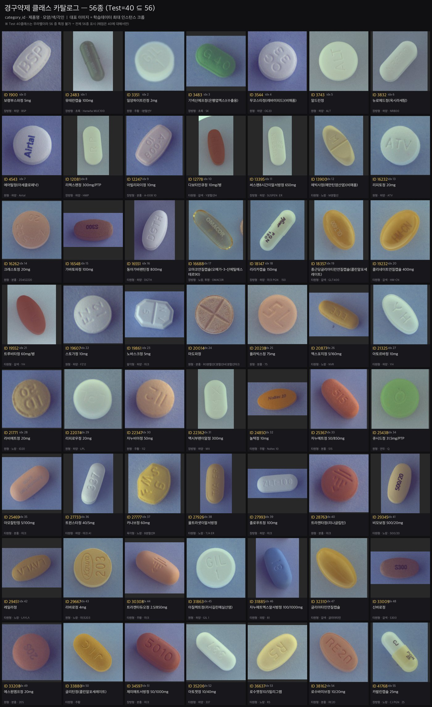

## 4. 베이스라인 — 다중 모델 공정 비교
무지성 모델 선택을 지양하고 **동일 fold·동일 하니스**로 후보를 비교했다(초기 단일폴드 스냅샷).

| 트랙 | 모델 | mAP(fold0) | 메모 |
| --- | --- | --- | --- |
| MPS(로컬) | YOLO11n | 0.686 | 최소 파라미터로 최고, turnkey |
| MPS | RetinaNet | 0.58 | 소데이터 수렴 열세 |
| MPS | YOLO26n | 0.48 |  |
| MPS | FCOS | 0.19 |  |
| CUDA(Colab) | RT-DETR-l | 0.737 | 트랜스포머-DETR, 전체 1위 |
| CUDA | FasterRCNN | 0.655 | MPS 0.0=발산 진단→warmup 복구 |

> **시행착오:** FasterRCNN이 MPS에서 mAP 0.0 → '버그가 아니라 학습 발산'으로 진단(검출수 0 근거), warmup·lr 조정으로 0.655 복구. — 숫자를 의심해 원인을 규명한 첫 사례.

**YOLO ≠ RT-DETR — 아키텍처별 튜닝은 처음부터 다르게** (한 세팅을 두 모델에 그대로 쓰지 않음):

| 항목 | YOLO11s/m (CNN·NMS) | RT-DETR-l (트랜스포머·NMS-free) |
| --- | --- | --- |
| 옵티마이저 | SGD(auto), lr0~0.01 | **AdamW, lr~1e-4** (DETR 표준) |
| 에폭 | ~100 수렴 | 더 길게 (DETR 느린 수렴, 100+) |
| 증강 | **mosaic=1.0 도움**, close_mosaic 마지막10 | mosaic 약하게/off (DETR 불안정화), 강한 기하 지양 |
| NMS | iou~0.6 튜닝 | **NMS 없음** → iou 무관 |
| 배치·웜업 | 16 | 작게(메모리), 안정 웜업 중요 |

> 최종적으로 이 다양성(CNN+NMS ↔ 트랜스포머+NMS-free)이 **WBF 앙상블의 상보성**으로 이어진다(§11).

## 5. 증강 — 합성의 도약, 그러나 '물량'은 플래토
AI Hub 단일 알약을 도메인(블루그레이)에 맞춰 조합 합성(SAM2 알파 매트 → 구조적 Copy-Paste). **합성 696장이 큰 도약**(클래스 커버리지). 그러나 그 이상 물량·분포는 오르지 않음(3폴드 평균, 누수無).

| 데이터 | mAP(3폴드평균) | 메모 |
| --- | --- | --- |
| real만 | 0.726 |  |
| + 합성696 | 0.905 | 합성의 도약 (+0.18) |
| + 합성696+1500(자연분포) | 0.896 | 플래토 |
| + 합성696+2500(균형분포) | 0.909 | 플래토(균형강제도 개선 아님) |

### 5-a. 단계별 합성 파이프라인 고도화 (기본 크롭 → Grabcut → SAM2 하이브리드)
합성 품질을 단계적으로 끌어올렸다. 핵심 원칙: **단일 알약을 (1) 도메인(연회색·주백색·준탑다운)으로 정규화한 뒤 조합 합성**(train 전용, val/test는 원본만 — 누수 차단).
- **1단계 — 기본 크롭컷**: 사각 크롭 붙여넣기. 빠르지만 경계 사각 이음새·배경 이질감 아티팩트.
- **2단계 — Grabcut 개선**: 전경/배경 그랩컷 세그멘테이션으로 알약 외곽만 따내 사각 이음새 제거. 그러나 반투명·저대비 연질캡슐에선 여전히 실패.
- **3단계 — SAM2 하이브리드 이미지처리** (`augment.py`): 불투명=휘도 Otsu+모폴로지+컨투어, 반투명·디퓨저=**SAM(prompt='pill')** 라우팅(품질 게이트로 CV 실패분만 SAM) → 알파 매트, 경계 1–2px 침식. + **WB 정규화**(gray-world, 알약영역 기준) + **정품 배경 생성**(train 빈영역 크롭·타일) + 2–4알 비겹침 배치·약한 그림자 → **알파 컴포지트**로 전역 bbox 좌표 산출.

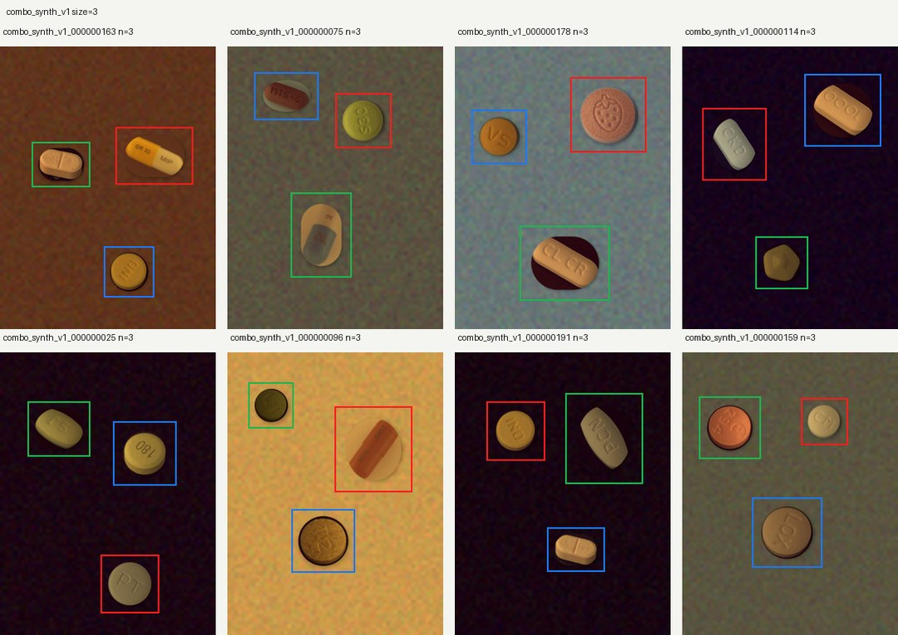

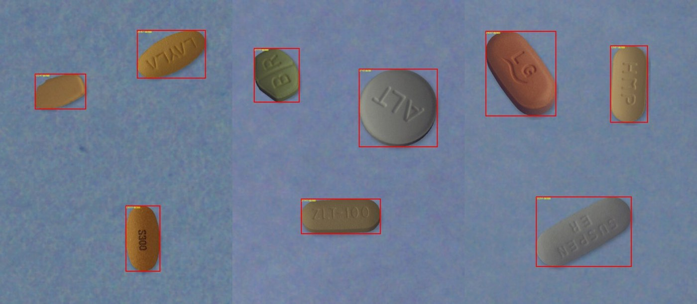

**3단계 이미지처리 — '포토샵 직관'을 CV 연산으로 등가 구현** (합성 경계·배경 결함 제거):

| 포토샵 아이디어 | CV 등가 | 고치는 결함 | 비용 |
| --- | --- | --- | --- |
| feather / 경계 블러 | 경계 alpha 블렌딩 | A만 (내부 평면 잔존) | 저 |
| 힐링 툴 (content-aware) | **`cv2.inpaint` (Telea/NS)** | A+B 동시 (주변 텍스처 전파) | 저 |
| 스탬프 툴 | 배경패치 복사+페더 | A+B (진짜 grain 보존) | 중 (클린패치 탐색) |
| 배경 분산 기반 생성 | median + 지역 노이즈 std 매칭 | A(페더 필요)+B | 중 |

> A=경계 halo/사각 이음새, B=배경 텍스처 불일치. 반투명 캡슐은 CV 분할 실패 → SAM 라우팅으로 마스크 확보(하이브리드의 이유).

**3단계 세부 산출물** — ① 단일알약 배경제거(SAM 컷아웃) → ② 배경(패치·생성) → ③ 최종 합성:

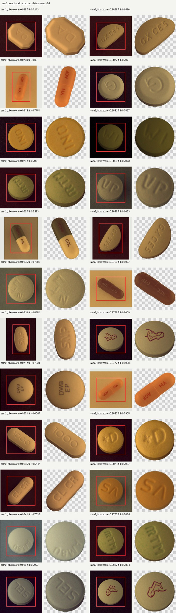

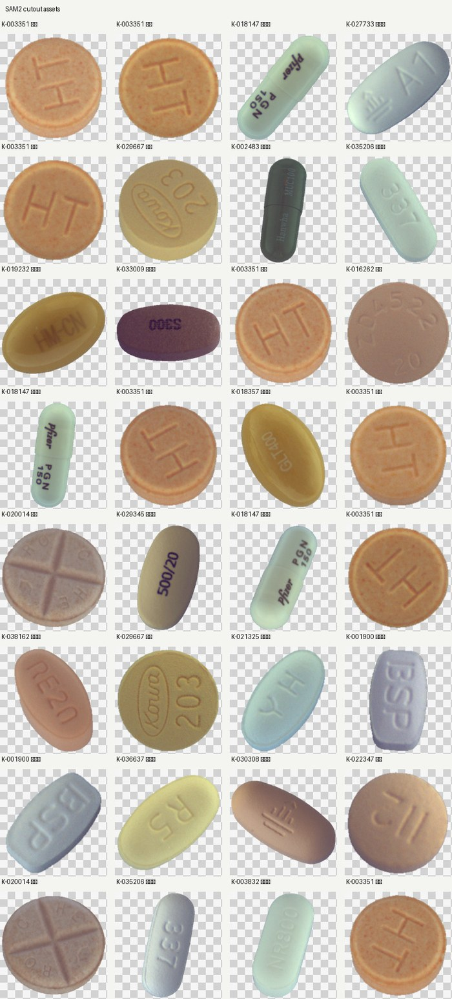

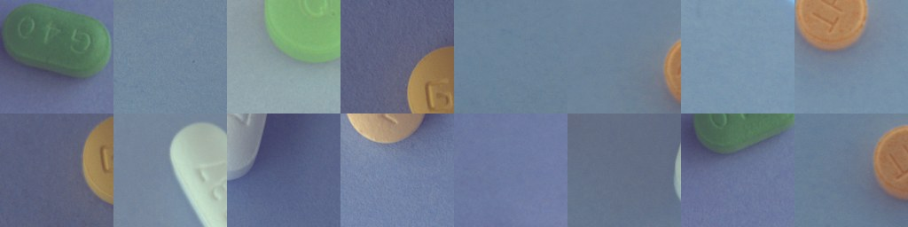

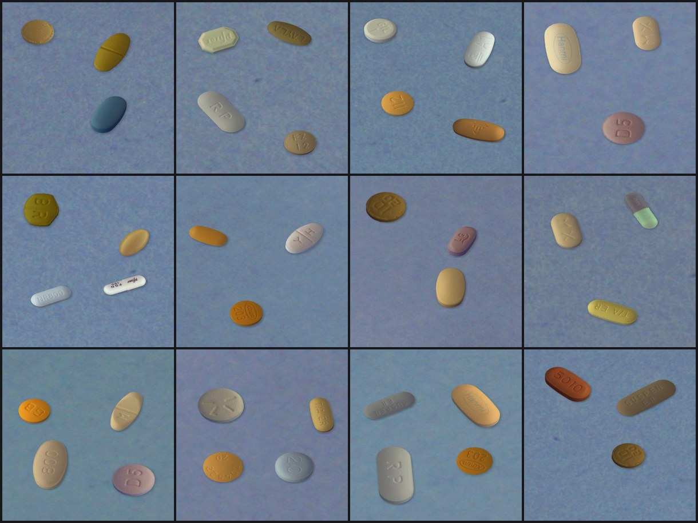

## 6. 평가 신뢰도 — 3대 함정 (이 프로젝트의 핵심 스토리)
**함정 ① 단일폴드는 순위를 못 가린다(노이즈).** fold0 하나에선 `696=0.933 → +2500=0.917 → +1500=0.871`처럼 '데이터 늘렸는데 하락'. 부트스트랩 **95% CI 전부 겹침**(val 51장). → **3폴드 GroupKFold** 폴드평균으로 판정(§5 표), 하락은 노이즈로 확정.

**함정 ② 대회 GT가 실알약 일부 누락.** 13건 확정, val 약 0.004 과소평가(§3).

**함정 ③ '0.960 vs 0.933' 채점 불일치 → 지표 범위 차이.** 하나는 mAP@[0.50:0.95](표준 COCO), 하나는 mAP@[0.75:0.95](대회). 버그 아님. → 지표 라벨 항상 명시, 대회 정답=0.75:0.95로 통일.

> **교훈:** 세 함정 모두 '그럴듯한 숫자'를 의심해 파고든 결과. **평가를 믿을 수 있게 만든 뒤에야** 이후 모든 실험이 의미를 가졌다.

## 7. 용량 · 해상도 · real-copy 누수 (자기검증)
데이터축이 막히자 다른 축을 검증(전부 누수無·대회지표).

| 모델 | 파라미터 | mAP(3폴드) | 메모 |
| --- | --- | --- | --- |
| YOLO11n | 2.6M | 0.905 |  |
| YOLO11s | 9.4M | 0.930 | 스윗스팟 (+0.025) |
| YOLO11m | 20M | 0.907 | base 877장 데이터기아→과적합 |

- **용량은 비단조** — 11s가 스윗스팟. 11m은 base에선 데이터기아(에폭 100으로도 회복 안 됨) → '더 큰 모델엔 더 많은 데이터' 실증(11m 진짜 판정은 데이터 확장 후로 보류).
- **해상도 폐기** — 학습·추론 960은 11n·11s 양쪽에서 640보다 하락.
- **real-copy 누수 자기검증** — real 알약 재조합 증강이 처음 최고(0.945)로 보였으나, `source_file`을 폴드에 매핑하니 소스=fold0-train 181장 → **fold1·2 val 알약이 train에 재등장=누수 확정**. 누수 없는 fold0에선 오히려 하락 → '+0.015'는 누수 산물, **무효화**. (남이 아니라 우리 결과를 스스로 의심해 잡아낸 사례.)

### 7-a. 성능 레버 판정 — 중간 스냅샷 → 최종 재정합 (56→118 전환 반영)
아래는 **base(56클래스·877장) 시점**의 '정직한 그림'과, [AI12] 커버리지 전환(118클래스+synth+AI Hub full) 이후 **바뀐 판정**을 나란히 둔 것이다.

| 축 (데이터·모델) | 중간 결과 | 중간 판정 | 최종 업데이트 ([AI12], 118cls) |
| --- | --- | --- | --- |
| 모델 용량 11n→11s | +0.025 (0.905→0.930) | ✅ 유일 확정 레버 | **11m 역전** — 데이터 확장으로 11m이 최고 단일 **0.9988** |
| 해상도 640→960 | 무효/하락 (fold0 −0.03) | ❌ | 변화 없음(폐기 유지) |
| 데이터 물량·분포 | 무효(플래토) | ❌ | 물량은 여전히 무효, 단 **커버리지(56→118)가 최대 레버**(§9) |
| 배경다양성 bg64 | 0.908 (약간 하락) | ❌ 기각 | 변화 없음 |
| real copy-paste | (당시) 착수 대기 | ⏳ 데이터축 마지막 검증 | **누수 확정 → 무효화**(위 §7) |

> **핵심 재정합 — 모델 체급 판정이 뒤집혔다.** base에선 11s가 '스윗스팟·유일 레버'였지만, 데이터가 **118클래스+synth696+AI Hub full(8,764장)**로 커지자 11m이 **데이터기아를 벗어나 최고 단일(0.9988 > 11s 0.9921)** 이 됐다 — 중간리포트의 '11m 판정은 데이터 확장 후로 보류'가 **예측대로 실현**(§11). 해상도·물량·bg64는 최종까지 판정 불변, real-copy는 누수로 무효화. 즉 '효과 없다'가 아니라 **'그 데이터 규모에선 아직'** 이었던 축(용량)과, 규모가 커져도 불변인 축(해상도)을 구분해냈다.

### 7-b. 학습·튜닝 항목별 판정 (우리 데이터 기준 — 비용 대비 효과)
점수 레버가 아닌 곳에 시간을 쓰지 않기 위해 튜닝 항목을 사전 판정했다(전형적 '시간낭비 함정' 회피).

| 항목 | 판정 | 근거 |
| --- | --- | --- |
| 프리징/전이(풀·파셜) | 낮음 | 프리징은 데이터 적을 때 이득 — 8,764장이면 **풀 파인튜닝이 정답**(232 초기엔 유효했겠지만 지금은 아님) |
| LR/웜업/하이퍼 미세조정 | 낮음 | ultralytics 디폴트(cosine·warmup3·lr0.01) 이미 강함, 마진 작고 val 노이즈에 묻힘 |
| 에폭 수렴 | **높음** | 큰 모델 50ep 미학습 확인 → 수렴까지(patience) 충분히, **이미 11m@100 적용** |
| box loss weight | 중간 | 지표가 mAP@[0.75:0.95] → **box=7.5↑**로 위치 정밀도 강조 시도 가치 有(우리 지표 특화) |
| Optuna/그리드서치 | 스킵 | 트라이얼당 ~1h MPS×다수, val 노이즈 ±0.02가 소효과 가림, 디폴트 강함 → **비용≫이득** |
| 오류분석(혼동행렬·에러유형) | **최고** | 어디서 틀리는지 알아야 표적 튜닝 — 블라인드 탐색 대신 이걸로 방향 결정 |
| Grad-CAM | XAI용 | 점수 레버 아님. 발표 XAI 크레딧엔 좋음(리포트용) |

## 8. AI Hub 조합 데이터 = 진짜 레버 ('0.93 천장' 정정)
'0.93이 천장'이라 본 것은 **좁은 실험 슬라이스만 판 오판**이었다. 리더보드 현실은 0.98~0.99. 미시도 핵심 레버는 **AI Hub 금지-아닌 조합 real 데이터**.
- **누수 검증 통과**: aihub 조합 ∩ 대회232 = 0, ∩ fold0-val = 0, 이미지완전일치 = 0 → real-copy와 정반대(같은 클래스·다른 조합·다른 사진 = 진짜 새 real).
- fold0 **+0.021 clean** · 스케일: POC 2,099장 → **FULL 7,836장/54클래스**. 인페인트 마스킹(하드 사각형→cv2.inpaint seamless)으로 아티팩트 제거.
- **리더보드 궤적**: 0.958 → 0.972 → **0.985**. 로컬 fold0 0.983 ≈ 리더보드 0.985 → **캘리브레이션 정렬 증명**(로컬 판정 신뢰).

> 강한 aug(0.841)·오버샘플(0.906)·회전은 전부 fold0 하락 = 진짜 안 통함. 부족했던 건 '진짜 real'이었음이 확정.

### 8-a. 추출·정제 파이프라인 (규칙 → 가치 → 라벨정합 → POC)
AI Hub '경구약제조합 5000종'에서 우리 클래스를 추출하되, **대회 규칙(금지 조합)·누수·라벨규약**을 단계별로 통제했다(`aihub_extract_poc.py`).

| 단계 | 결과 |
| --- | --- |
| **규칙·누수 검증** | ✅ 허가 3,503조합, 금지본(TL_2/TS_2)과 0중복, 대회 232조합과 0중복(누수 없음), 규칙 부합 |
| **가치 평가** | ✅ 54/56 클래스 커버, 희소클래스 real 대량보강(대회 3샘플 → 100+) |
| **라벨 규약 버그** | AI Hub raw `dl_idx`(예 249) ≠ 폴더 `K-code`(250) 발견·수정 → 우리 `category_id=K-code`로 정합(대회 매핑과 일치, ID 버그 차단) |
| **POC 추출** | 2,099장(700조합 × ~3장), our-class **4,398 인스턴스**, 비-우리 **3,951알 배경마스킹**(인페인트), 육안 라벨 정확 |

### 8-b. 누수·규칙 검증 (객관적)
real-copy 누수(§7)의 교훈으로, 새 real 데이터가 **'진짜 새 조합·새 사진'인지 코드로 교차검증**했다 — 같은 클래스라도 조합·이미지가 겹치면 누수이기 때문.

| 체크 | 결과 |
| --- | --- |
| aihub 700조합 ∩ 대회 232조합 | **0** (다른 조합) |
| aihub ∩ fold0-val 조합·이미지 | **0** (누수 아님) |
| 금지본(TL_2/TS_2) 포함 | **0** (구조적 제외 + 요건 충족) |
| **fold0 효과** | **0.956 → 0.977 (+0.021)** |

> real-copy(§7)는 `source_file`이 fold0-train과 겹쳐 **누수→무효화**됐지만, AI Hub 조합은 위 세 교차검증을 전부 0으로 통과 = **정반대의 '진짜 새 real'**. 그래서 fold0에서 순증(+0.021)이 유지된다.

## 9. 대회 교체 [AI12] — 커버리지 대전환 (56 → 118) ★
새 리더보드([AI12])는 **같은 test842 이미지 + 확장된 GT(클래스 71~79)**로 채점. 56만 잡는 모델은 급락(0.71~0.74), 전 클래스 학습팀은 0.95+. **병목은 정확도가 아니라 커버리지**였다.
- **결정적 증거 — 같은 모델, 두 리더보드**: 동일 제출본 `s11s_full232_synth696`이 **원 대회 LB 0.958 → [AI12] LB 0.7095**. 모델·예측은 그대로인데 **채점 GT만 56→확장으로 바뀌자 급락** = 병목이 정확도가 아닌 **커버리지임을 단일 변수로 증명**(§7 '데이터 물량은 무효, 커버리지가 최대 레버'와 정합).
- AI Hub 조합 라벨엔 **116 클래스 이미 존재**(우리가 62개를 인페인트로 지워온 것) → 안 지우고 **전량 추출 10,489장** → real56 ∪ aihub116 = **118클래스**(인페인트 불필요, 오히려 단순).

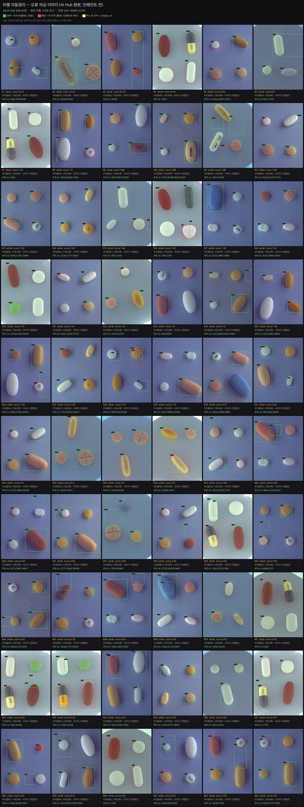

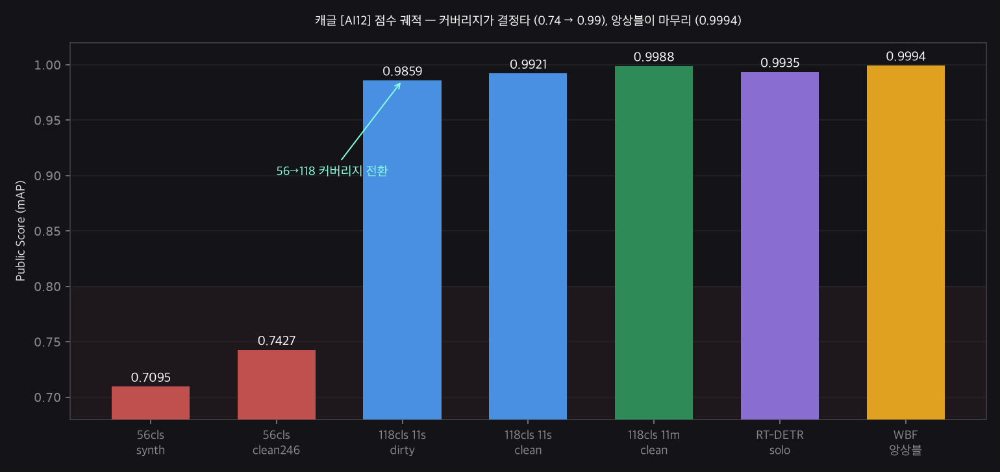

| 제출본 | Public |
| --- | --- |
| 11m clean | 0.9988 |
| WBF 앙상블 | 0.9994 |

*(제출본별 박스 통계는 노트북 실행 셀에서 확인. 전체 리더보드는 §11 표 참조.)*

## 10. 자동 라벨 품질 유틸리티 2종 — 검출기 + 교정기
라벨 품질을 사람 손이 아니라 **코드로 강제**하기 위해 두 유틸리티를 만들었다. ⓐ **교정기**(`gen_gt_corrections.py`) = 대회 기본 GT의 **누락 라벨 검출·자동교정**, ⓑ **검출기**(`label_audit.py`) = AI Hub 소스 라벨의 **오류(비박스 오배치·라벨누락) 2트랙 감사**. 둘 다 대회 원본·팀 파일은 무수정, 우리 로컬 사본만 생성한다(재현 코드: `src/`).

### 10-a. 교정기 — GT 누락 자동교정 (`gen_gt_corrections.py`)
combo 파일명이 약품 구성의 SSOT다. **combo 약품집합 − GT 클래스집합 = 통째 누락(유형 A)** → 결정론적 완전탐지 후 검출기가 박스를 자동으로 채운다(conf 0.85~0.99). 동일 클래스 2번째 실알약(**유형 B**)은 '검출박스 중 모든 GT와 IoU<0.3인 여분'으로 플래그(클래스만 수동확인). 산출은 로컬 `corrected_coco.json` — 대회 원본 GT는 건드리지 않는다.
- **유형 A 8장·8박스 자동채움**(검출기 못 채운 미해결 gap 0) · **유형 B 6건/5장 플래그** · 검출기+육안 교차검증 **8/8 전부 실물 알약 확정**(오탐·엣지잘림 0).
- 효과: 무라벨 실알약이 FP로 계산되던 것을 교정 → val 약 **+0.004** 정정(대부분 일양하이트린 3351에 편중).

| 이미지(combo) | +클래스 | 약품명 | conf |
| --- | --- | --- | --- |
| K-003351-013900-021325 | 3351 | 일양하이트린정 2mg | 0.845 |
| K-003351-013900-036637 | 3351 | 일양하이트린정 2mg | 0.965 |
| K-003351-020014-022074 | 20014 | 마도파정 | 0.984 |
| K-003351-021325-032310 | 32310 | 글리아타민연질캡슐 | 0.995 |
| K-003351-032310-038162 | 3351 | 일양하이트린정 2mg | 0.978 |
| K-003351-033880-038162 | 33880 | 글리틴정(콜린알포세레이트) | 0.957 |
| K-003351-035206-041768 | 3351 | 일양하이트린정 2mg | 0.966 |
| K-003544-…-016548 | 4543 | 에어탈정(아세클로페낙) | 0.900 |

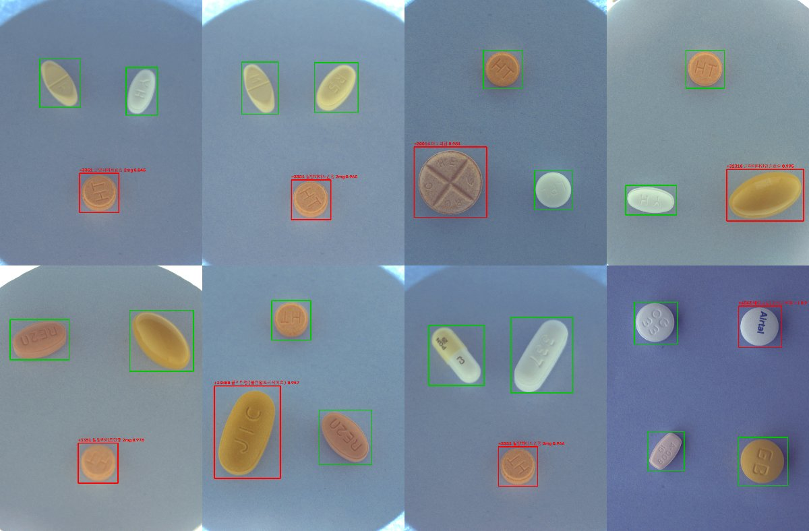

**교정기 산출물** (`data/gt_corrected/`, 대회 원본 GT 무수정 — 우리 사본만):

| 파일 | 내용 |
| --- | --- |
| `corrected_coco.json` | 원본 GT + 유형 A 8박스 병합 (`source` 태그로 구분: official / corrected_A) |
| `corrections.json` | 교정 상세 (A 8건 + B 6건 플래그 + 미해결 0) |
| `review/corr_*.png` · `review_contact.png` | 검수 오버레이 (초록=원본, 빨강=추가) |
| `report.md` | 요약 표 |

- **유형 A 8건**: 검증 완료·자동채움 확정(결정론적 탐지 + 검출기 박스 conf 0.85~1.00, 미해결 0).
- **유형 B 6건/5장**: 플래그만(동일 클래스 2번째 실알약 의심 → 클래스 수동확인 필요, 자동 미반영) — 정직성을 위해 자동교정 대상에서 제외.

### 10-b. 검출기 — 2트랙 오류 의심 추출 파이프라인 (`label_audit.py`)
AI Hub 소스 라벨 자체가 dirty(비박스 오배치·라벨누락). 사람이 수천 장을 볼 수 없어 **'모델 불일치' + '기하 휴리스틱' 2트랙 신호를 가중합해 의심 라벨을 랭킹** → 사람은 상위만 수분 검수한다.
- **파이프라인 6단계**: ① 대상 선정(real232 교정 + aihub7836, synth 제외=프로그램 라벨) → ② 강한 모델 예측(fold0 최고모델 0.985) → ③ GT↔예측 IoU 최적매칭 → ④ 2트랙 플래그(모델불일치 + 박스형태 이상) → ⑤ 가중합·랭킹(내림차순) → ⑥ 출력(`suspects.csv` + 컨택트시트 상위60).
- **왜 2트랙인가**: ⓐ 모델 불일치(강한 모델이 '자신있게' GT와 다르면 라벨 의심 — Confident Learning 계열) + ⓑ 기하 휴리스틱(모델 없이 박스 '형태'만으로 명백한 오류 검출) → 상보적(기하가 모델 오탐을 보정).

**스코어링 규칙** (플래그 · 조건 · 가중치 — 여러 플래그 동시 해당 시 점수 급상승 → 진짜 나쁜 라벨이 상위로):

| 플래그 | 조건 | 가중치 |
| --- | --- | --- |
| `no_pred_match` (위치오류) | 매칭 IoU < 0.3 | **3.0** |
| `degenerate` (퇴화박스) | 폭/높이 ≤ 2px | **3.0** |
| `out_of_bounds` (경계이탈) | 이미지 밖 좌표 | 2.5 |
| `class_mismatch` (클래스오류) | 매칭됐으나 클래스 불일치 | 2.5 |
| `missing_gt` (라벨누락) | 고신뢰(>0.6) 검출인데 GT 없음 | 2.0×conf |
| `size_outlier` (크기이상) | 클래스 중앙면적 4배↑ / ¼↓ | 1.5 |
| `extreme_aspect` (비율이상) | 종횡비 > 6 또는 < 1/6 | 1.5 |
| `loose_bbox` (박스느슨) | 매칭되나 IoU 0.3~0.6 | 1.0 |

**검증(객관적)**: aihub7836 + real232 = **8,068장 중 246장(3%)** 자동 검출 — 팀원 수작업 ~300장과 동급 규모, **사람 개입 0**. fold0 제거실험 **0.9833 → 0.9860 (+0.0027)**, 문제는 **aihub 소스 라벨에 집중(240/246)**. 이후 **cover116(118클래스)로 확대 적용 → 485/10,721(4.5%)**, 캐글 **clean > dirty +0.0062**.
**한계·확장**: 현재 모델이 대상 이미지를 학습에 포함(in-sample) → 나쁜 라벨 일부 암기 가능 → **OOF(교차검증 예측)** 로 자기예측 편향 제거 · **Cleanlab(confident learning) 정식 결합**으로 확률 보정 · 최종은 팀원 수작업 목록과 교차검증해 제거 리스트 확정 → 재학습.

아래는 cover116 확대 적용의 플래그 분포(라이브)와 상세 다이어그램·의심 그리드·클로즈업:

*(cover116 확대 적용 — 총 의심 485장 / 10,721(4.5%). 플래그 분포: 라벨누락·위치오류·클래스오류·박스느슨 등. 상세는 노트북 실행 셀 참조.)*

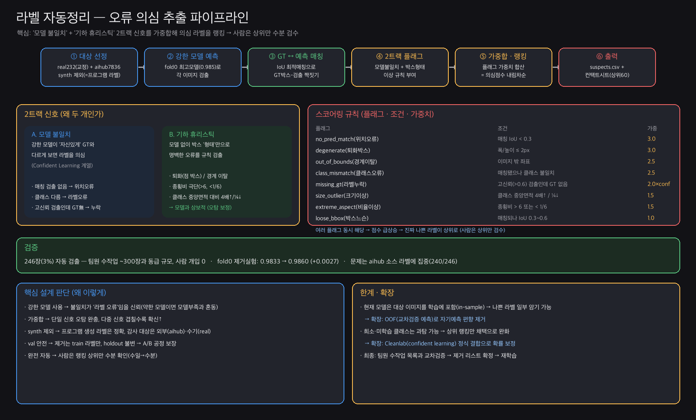

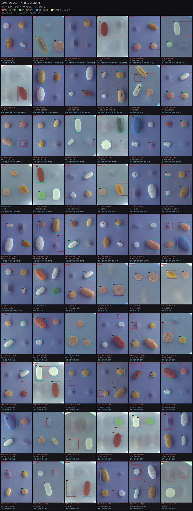

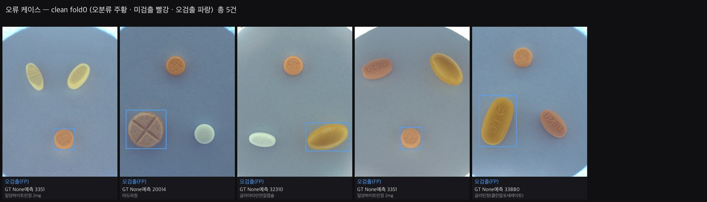

## 11. 용량 · 앙상블 — 마지막 한 방울
- **11m(용량↑·보수적) > 11s** (0.9988 vs 0.9921) — 이 지표는 정밀도(오탐억제)를 보상 → 클래스를 더 잡은 11s가 오히려 손해.
- **RT-DETR**(트랜스포머·NMS-free) 다양성 + **WBF 앙상블**. 30박스/img를 그대로 섞으면 폭증본이 되어 하락 위험 → **보수적 융합**(skip_box_thr 0.2~0.3, ~4/img)으로 합의 박스만 정밀화 → **0.9994(+0.0006)**.
- 예측버그(MPS INT_MAX·CUDA OOM)는 **per-image 예측**으로 회피.

**[AI12] 리더보드 최종 제출 (Public Score, 내림차순):**

| 제출본 | Public | 비고 |
| --- | --- | --- |
| `submission_wbf_11m_rtdetr_skip03.csv` | **0.9994** | WBF 앙상블 (best) |
| `submission_wbf_11m_rtdetr_skip02.csv` | **0.9994** | WBF 앙상블 (동률) |
| `submission_yolo11m_..._cover118_clean.csv` | 0.9988 | 11m 118 clean (최고 단일) |
| `submission_rtdetr_cover_clean.csv` | 0.9935 | RT-DETR solo |
| `submission_yolo11s_..._cover118_clean.csv` | 0.9921 | 11s 118 clean |
| `submission_yolo11s_..._cover118.csv` | 0.9859 | 11s 118 dirty |
| `submission_s11s_..._synth696_aihubfull_clean246.csv` | 0.7427 | 56cls clean246 |
| `submission_s11s_full232_synth696.csv` | 0.7095 | 56cls synth base |

> 56cls(0.71~0.74) → 118cls(0.986~0.999)의 계단 = 커버리지 전환의 효과. 그 위에서 **용량(11m)·라벨정리(clean)·앙상블(WBF)**이 마지막 소수점을 채웠다.

## 12. 데이터 엔지니어링 3트랙 (Codex)
상용 커버리지(~25,000 클래스)를 위해 Codex가 **수집 → 경량화 → 오토라벨 V2**를 구축(우리 모델링과 나란히).

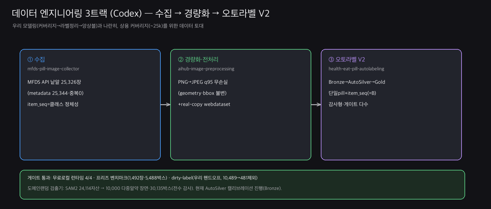

- **① 수집** `mfds-pill-image-collector`: MFDS API 낱알 **25,326장**(metadata 25,344·중복0). `item_seq`=클래스 정체성.
- **② 경량화·전처리** `aihub-image-preprocessing`: PNG→**JPEG q95 무손실**(geometry·bbox 불변) + real-copy webdataset 핸드오프.
- **③ 오토라벨 V2** `health-eat-pill-autolabeling`: **Bronze→AutoSilver→Gold** 감사형, **단일 pill 검출 + item_seq 식별**(=상용 B). 게이트: 런타임4/4·프리즈벤치마크(1,492장·5,488박스)·dirty-label(**우리 핸드오프 10,489→481제외**)·도메인랜덤(10,000장·30,135박스).

**118 클래스 카탈로그**(우리 커버리지 학습 클래스, id·K-code·제품명):

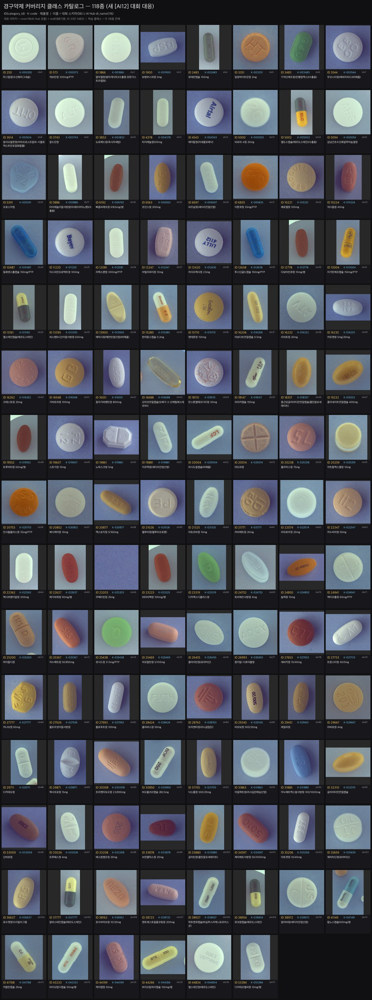

### 12-a. 오토라벨링 V2 — 프로덕션 파이프라인 (⚠️ 진행 중 · 중간보고)
> **이 절은 아직 완성 전 진행 중 트랙의 중간보고**다(캐글 이후 상용화 B의 검출 토대). 자동 출력은 전부 **Bronze(미검증 제안)**이며, 학습 투입(AutoSilver) 승격은 현재 **보류(fail-closed)** 상태다.

**목표·철학**: MFDS **25,326장**을 **사람 per-image 라벨 0**으로 자동라벨. 단 '측정 안 된 모델 출력=정답'이 아니라 **자동 기권(abstention) + 독립 합의 + 캘리브레이션 승격 + 재현 롤백**으로 품질을 만든다(검출=단일 `pill` 클래스, 제품식별=별도 open-set retrieval, `item_seq`는 annotation 속성).

**V1 → V2 보정 (감사로 잡은 3대 결함):**
- 외부모델(SAM/YOLO)이 실제 추론 안 하는 `adapter_pending` 슬롯 → **격리 실제 worker**로 교체(runtime 부재는 명시적 readiness 실패)
- detection taxonomy가 **25,344 제품ID를 클래스로 오용**(1클래스당 ~1장) → **단일 `pill` 클래스**로 정정
- **coverage를 accuracy로 착각**(25,326 처리→10,440장 후보 41%인데 정밀도·IoU 미측정) → **MFDS 벤치마크 캘리브레이션 게이트** 도입

**라벨 티어 (승격은 게이트 통과 시에만):** **Bronze**(기본·미검증) → **AutoSilver**(캘리브레이션 합의 게이트 통과 시 per-image 리뷰 없이 학습 투입) → **Gold**(사람 리뷰 필수). 현 시점 외부 runtime 0/5·MFDS 캘리브레이션 리포트 없음 → **AutoSilver=0이 정상**(fail-closed).

**AutoSilver 승격 조건**(전부 충족): MFDS 도메인 캘리브레이션 ≥500장 · Wilson 하한 ≥99.5% · 지원 전략 ≥3·독립 패밀리 ≥2 · pairwise IoU ≥0.80 · 엣지 분산 ≤0.035 · 품질 ≥0.90 · **정확 인스턴스수 합의** · 캘리브레이션 해시 안정. → **coverage만으로는 절대 승격 안 함.**

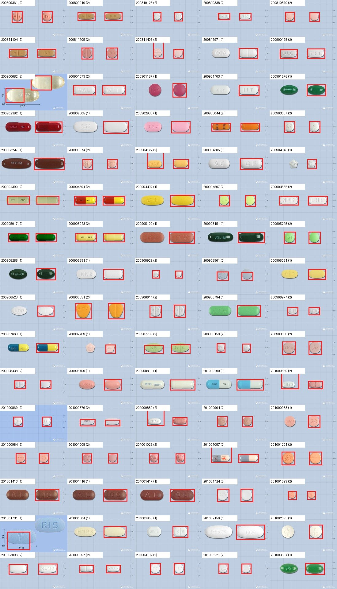

**템플릿 드리프트 라우팅** (25,326장 프로파일 — 커버리지 하락은 노이즈가 아니라 파이프라인/템플릿 이동):

| 템플릿 | 이미지 | V1 strict 커버리지 |
| --- | ---: | ---: |
| 1299×709 grid | 11,848 | 72.4% |
| 780×426 close-up | 13,476 | 13.9% |
| nonstandard | 2 | — |

→ 등록연도별로도 68.7%(pre-2016) → 22.2% → 14.2%(2021+) 하락. 템플릿·대비·노이즈·metadata로 **전략 라우팅**(grid=고전 분할 우선, close-up=metadata/SAM3/YOLOE + SAM2.1 refine).

**AIHub dirty-label 게이트**(우리 핸드오프 → 직접 감사): 정적 제외 리스트만으론 불충분 → `label_audit.py` **직접 감사 필수**.

| 항목 | 수 |
| --- | ---: |
| 소스 이미지 | 10,489 |
| 랭크된 의심 | 628 |
| 자동 제외 | 481 (정적리스트 밖 미라벨 **2건 직접 발견** 포함) |
| **clean 학습 투입** | **10,008장 / 38,499박스** |

**도메인 shortcut 교정**: 첫 클린 컴포지트 검출기가 **씬당 ~1알만 검출**(다수 synth가 어두운 배경 → 도메인 지름길 학습). → **24,114 SAM2 알파 자산을 밝은 절차생성 배경에 10,000 씬 재합성**(박스는 알파마스크에서 유도, MFDS 픽셀 미사용). 독립 감사 **10,000 JPEG·30,135 박스 전량 검증**.

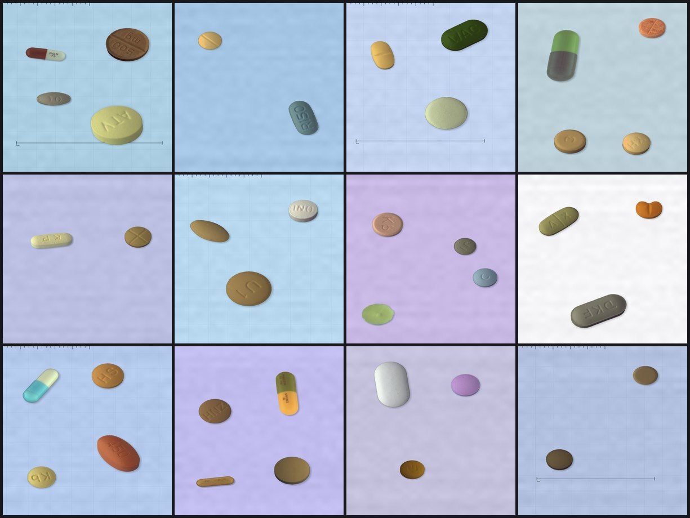

**클린 컴포지트 검출기 데이터셋** (누수 0·독립 감사 통과):

| 구성 | 수 |
| --- | ---: |
| 필터된 official 단일 알약 | 10,031 |
| 프로그램 합성 조합 | 10,000 |
| 직접감사 official real 조합 | 10,008 |
| **합계** | **30,039장 / 78,665박스** (train 26,031 / val 4,008) |
| 조합 K-code 그룹 누수 · 벤치마크 overlap | **0 / 0** |

**독립 로버스트니스 벤치마크**: AIHub `combo_real` **1,492씬·5,488박스**, 학습·승격검증과 **zero overlap**, 소스·샘플·COCO 해시 고정. **릴리스 계약**: 단일 pill COCO(canonical) → YOLO·**결정론적 WebDataset shard**(원자적 rename·해시). 라이선스 게이트(SAM3 Meta License·Ultralytics AGPL/Enterprise) 승인 전 공개 릴리스 차단.

> **다음 하드 게이트**: 독립 외부모델 **2패밀리 이상 확보 → MFDS 도메인 캘리브레이션 벤치마크 → 계층화 매트릭스 → AutoSilver 하한 정책 통과**. 그 전까지 출력은 **감사가능 Bronze 제안**이지 검증된 정답이 아니다. (상용 로드맵 A→B의 B 검출 토대, §13.)

## 13. 상용 서비스 설계 — 검출 → 검색 (A→B)
소프트맥스 검출헤드는 25k 미세식별에 무리 + **파레토**(제품 외형 80%커버≈1~3천).
- **1차 A(단일 검출기, 큐레이션 1~3천)** — 캐글 승자 파이프라인 계승, 빠른 출시.
- **확장 B(검출+임베딩 검색, 전체 25k+)** — 신약=재학습 아닌 **등록(enroll)**, top-k, '미상=확인필요'(의료안전). Codex가 이미 B의 검출 토대 구축.
- 서빙: FastAPI+Vercel+Supabase+e약은요(임상정보), 문서 05·04 계승.

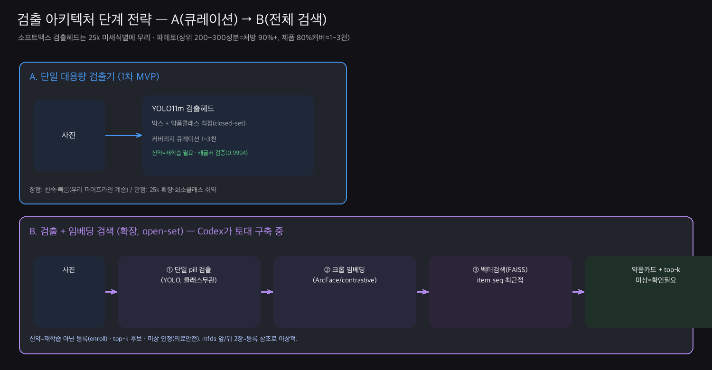

## 14. 멀티머신 인프라 (재사용 자산)
3머신(MacBook·Mac Studio·Colab) 병렬, **git=버스**(코드·소결과) + 대회 후 **썬더볼트+SMB**(GB/s·상호 로컬급) + **Tailscale**(고정주소·원격)로 수동복사 제거.

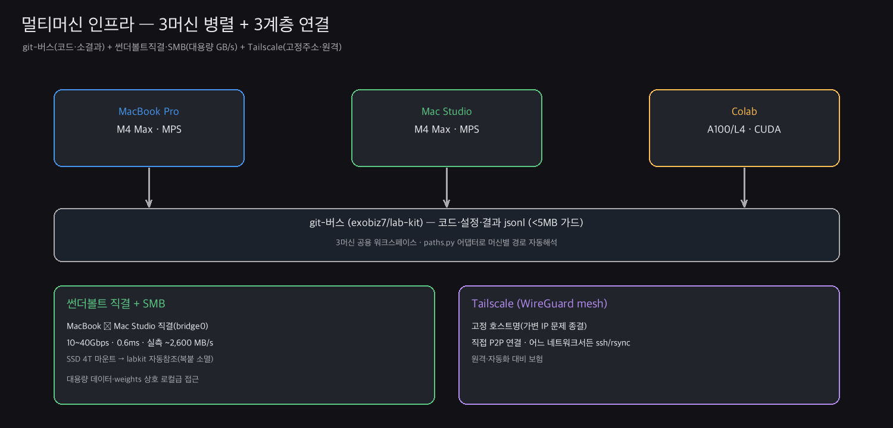

## 15. 발견 · 통찰 · 교훈
1. **평가부터 믿을 수 있게** — 3대 함정(단일폴드 노이즈·GT누락·지표범위)을 걸러낸 뒤에야 실험이 의미.
2. **더 많은/큰 것이 항상 낫지 않다** — 합성 물량·해상도·모델체급 모두 반례.
3. **출처(source)를 끝까지 추적** — GT누락·real-copy 누수 모두 '어디서 왔나'로 발견(자기검증).
4. **커버리지가 최대 레버** — 56→118(0.74→0.99). 정밀도 지표라 보수적 모델이 유리.
5. **합성 > 물량복제**, **현실적 증강만** 통함(강aug 도메인붕괴).
6. **라벨 품질 자동화 유효** — 검출기 2트랙(+0.006)·교정기 GT누락 8/8 자동교정, **앙상블은 '어떻게'**(폭증 폐기·보수적 융합).
7. **검출헤드 한계 + 파레토 → A→B 단계전략**. AI Hub 소스 라벨 dirty(우리·Codex 양측 실증).

## 16. 자산 · 재현 · 맺음
- **코드/실험**(git-버스 `exobiz7/lab-kit`, 팀 사본 `beamsearch/LHK/src/`): 검출기 `label_audit.py`·교정기 `gen_gt_corrections.py`·`wbf_ensemble.py`·`aihub_extract_cover.py`·`final_submission.py`·`kfold_exp.py`·`make_*` 시각화·RT-DETR resumable 노트북.
- **설계문서**: `pilldet-mono/docs/00~09`(09=상용 로드맵), LHK `중간리포트_ModelArchitect.md`·`augmentation_design.md`·`02~04` 노트북.
- **Codex 레포**: `github.com/exobiz7/{health-eat-pill-autolabeling, mfds-pill-image-collector}` + `aihub-image-preprocessing`(로컬).
- **무거운 자산(→ 팀 구글드라이브)**: `reports/TEAM_DRIVE_ASSETS.md` 참조(weights·cover116·번들·제출CSV·풀해상도 시각자산).

### 맺음
돌아보면 이 프로젝트에서 정말 남는 것은 특정 점수가 아니라 **'믿을 수 있는 결론을 내는 과정'** 그 자체였습니다. 그럴듯해 보이는 숫자를 그대로 받아들이지 않고, 통념을 데이터로 하나씩 검증하고 노이즈·누락·누수를 직접 걸러냈습니다. 그렇게 쌓은 신뢰 위에서 문제의 본질이 커버리지임을 실증했고, 마침내 0.9994에 이르렀습니다.

무엇보다 여기서 만든 **커버리지·자동 라벨정리·앙상블·검출→검색 설계는 대회에서 끝나지 않고 그대로 상용화(Phase 3~4)의 토대**가 됩니다. 점수는 여정의 한 지점일 뿐, 진짜 자산은 그 과정에서 쌓인 규율과 재사용 가능한 도구들이라고 생각합니다. 끝까지 읽어주셔서 감사합니다. 🙂
