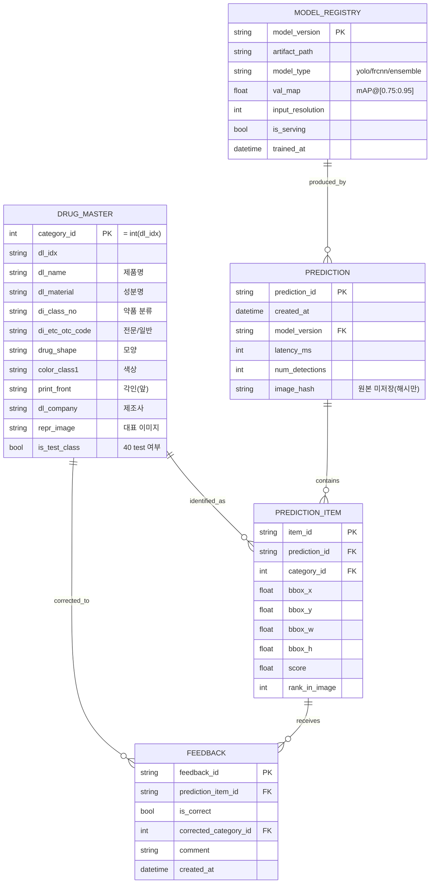

# 데이터 모델 설계서 (Data Model & ERD) — 문서 A

> **코드잇 스프린트 AI 엔지니어링 12기 · 초급 프로젝트 · 3팀 (ULTRA CAPSHYONG ITEM WITH 4 VALUES)**
> 문서 계보: 계획서 → SRS → PRD → 실행 전략 → **〔보강 A〕 데이터 모델 설계서** (B: 서빙·배포 / C: UX·데모는 별도)
> 작성: 이형기(Model Architect) · 작성일 2026-06-26 · v0.1
> 충족 요구사항: DR-04(category 매핑), FR-03(클래스 예측), 실행전략 §6.1(서비스 인텔리전스 레이어)

---

## 0. 문서 개요

### 0.1 목적
모델 출력을 **실제 약 정보로 변환**하고, 서비스가 동작·기록·학습되도록 하는 **데이터 구조**를 정의한다. 본 설계의 중심은 두 가지다.
1. **SSOT 매핑 체인** — `category_id ↔ dl_idx ↔ 약 정보`를 단일 진실 공급원으로 고정 (§2)
2. **`drug_master`** — COCO 메타데이터에서 추출하는 약품 마스터 테이블 (§5.1, §6)

### 0.2 범위
- **포함:** 소스(COCO) 데이터 구조 요약, 서비스 데이터 모델(ERD), 데이터 사전, `drug_master` ETL, 품질 규칙, 티어별 구현
- **제외:** API I/O·배포 토폴로지(→문서 B), 화면·디스클레이머(→문서 C)

---

## 1. 데이터 도메인 개관 — 두 개의 세계

| 세계 | 성격 | 구성 | 용도 |
| --- | --- | --- | --- |
| **소스 데이터 (COCO)** | 읽기 전용·학습용 | `images / annotations / categories` (JSON) | 모델 학습 + `drug_master` 추출 원천 |
| **서비스 데이터 (DB)** | 운영·기록·학습 | `drug_master` + 추론 로그 + 피드백 + 모델 레지스트리 | 웹 서비스 동작·관측·재학습 |

> 소스 COCO는 변형하지 않는다. 여기서 **추출(ETL)** 한 `drug_master`가 두 세계를 잇는 다리다.

---

## 2. ID 체계 / 매핑 체인 (SSOT) ★

이 프로젝트 모든 ID 버그의 진원지이자, 모델·제출·서비스를 잇는 척추.

```
 ┌─ 모델 내부 ────────────────────────────────────────────────┐
 │  model_class_index   (0 … K-1, 프레임워크 내부 인덱스)        │
 └───────────────┬───────────────────────────────────────────┘
                 │  class_map.json  (양방향 매핑 — SSOT 아티팩트)
 ┌───────────────▼───────────────────────────────────────────┐
 │  category_id   (제출 CSV·drug_master PK)  = int(dl_idx)     │  ← DR-04 / IR
 └───────────────┬───────────────────────────────────────────┘
                 │
 ┌───────────────▼───────────────────────────────────────────┐
 │  dl_idx        (원본 알약 식별자, images[].dl_idx)          │
 └───────────────┬───────────────────────────────────────────┘
                 │
 ┌───────────────▼───────────────────────────────────────────┐
 │  약 정보  (dl_name·dl_material·di_class_no·di_etc_otc_code…) │  ← 실행전략 §6.1
 └────────────────────────────────────────────────────────────┘
```

- **데이터 가공 규칙(소스 명세):** `category_id`는 각 JSON 첫 이미지의 `dl_idx`를 정수화해 부여됨 → **category_id ↔ dl_idx는 결정적(deterministic)**.
- **SSOT 아티팩트:** `class_map.json`(model_index ↔ category_id) + `drug_master`(category_id ↔ 약 정보). 이 둘만이 ID의 진실이며, 학습·추론·제출·서비스가 **모두 이 파일을 참조**한다.
- **불변식(invariant):** 제출 CSV의 모든 `category_id` ∈ Test 40클래스, 그리고 ∈ `drug_master.category_id`. (위반 시 제출 0점 또는 서비스 카드 누락)

---

## 3. ERD



---

## 4. 엔티티 명세 (목적 · 티어)

| 엔티티 | 목적 | 구현 티어 |
| --- | --- | --- |
| **drug_master** | category_id → 약 정보 카드. 서비스 지능 레이어의 실체 | **MVP(T1)** — 정적 JSON/CSV |
| **prediction** | 추론 1회 세션 로그(지연·모델버전) | T2 — Supabase |
| **prediction_item** | 검출 객체 단위 결과(bbox·score·클래스) | T2 — Supabase |
| **feedback** | 사용자 교정 라벨 → 재학습 소스 | 심화 — MLOps |
| **model_registry** | 모델 버전·성능·서빙 여부 | 심화 — MLOps |

> **과설계 방지 원칙:** MVP는 `drug_master` 단일 테이블(정적 파일)만으로 완성된다. 나머지는 *지금 설계, T2/심화에서 구현*.

---

## 5. 데이터 사전 (Data Dictionary)

### 5.1 `drug_master` — COCO 출처 매핑 ★

> 모든 컬럼은 `train_annotations` JSON의 `images[]` 메타데이터에서 추출. `(M)`=서비스 카드 필수, `(O)`=선택.

| 컬럼 | 타입 | COCO 출처 | 설명 | 카드 |
| --- | --- | --- | --- | --- |
| **category_id** (PK) | int | `annotations[].category_id` (=int `dl_idx`) | 제출·모델·서비스 공통 키 | (M) |
| dl_idx | str | `images[].dl_idx` | 원본 알약 식별자 | (O) |
| **dl_name** | str | `images[].dl_name` | 제품명 | (M) |
| dl_name_en | str | `images[].dl_name_en` | 제품명(영) | (O) |
| **dl_material** | str | `images[].dl_material` | 성분명 | (M) |
| dl_material_en | str | `images[].dl_material_en` | 성분명(영) | (O) |
| **di_class_no** | str | `images[].di_class_no` | 약품 분류 | (M) |
| **di_etc_otc_code** | str | `images[].di_etc_otc_code` | 전문/일반의약품 | (M) |
| chart | str | `images[].chart` | 제형 | (O) |
| form_code_name | str | `images[].form_code_name` | 정제 분류명 | (O) |
| **drug_shape** | str | `images[].drug_shape` | 모양 | (M) |
| **color_class1** | str | `images[].color_class1` | 색상1 | (M) |
| color_class2 | str | `images[].color_class2` | 색상2 | (O) |
| **print_front** | str | `images[].print_front` | 식별문자(앞)/각인 | (M) |
| print_back | str | `images[].print_back` | 식별문자(뒤) | (O) |
| line_front | str | `images[].line_front` | 앞면 분할선 | (O) |
| line_back | str | `images[].line_back` | 뒷면 분할선 | (O) |
| leng_long | num | `images[].leng_long` | 장축(mm) | (O) |
| leng_short | num | `images[].leng_short` | 단축(mm) | (O) |
| thick | num | `images[].thick` | 두께(mm) | (O) |
| **dl_company** | str | `images[].dl_company` | 제조사 | (M) |
| dl_company_en | str | `images[].dl_company_en` | 제조사(영) | (O) |
| di_company_mf | str | `images[].di_company_mf` | 위탁제조사 | (O) |
| item_seq | num | `images[].item_seq` | 품목기준코드 | (O) |
| di_edi_code | str | `images[].di_edi_code` | EDI 코드 | (O) |
| dl_mapping_code | str | `images[].dl_mapping_code` | 제품코드 | (O) |
| di_item_permit_date | date | `images[].di_item_permit_date` | 허가일자 | (O) |
| mark_code_front | str | `images[].mark_code_front` | 앞면 마크 코드 | (O) |
| mark_code_back | str | `images[].mark_code_back` | 뒷면 마크 코드 | (O) |
| supercategory | str | `categories[].supercategory` | 슈퍼 카테고리 | (O) |
| category_name | str | `categories[].name` | 카테고리명 | (O) |
| **repr_image** | str | `images[].file_name`/`img_key` | 대표 이미지 경로 | (M) |
| **is_test_class** | bool | 파생 | Test 40클래스 포함 여부 | (M) |
| source | str | 파생 | 추출 출처(JSON 경로 등) | (O) |
| created_at | datetime | 파생 | 생성 시각 | (O) |

> **서비스 카드(MVP)** = `(M)` 컬럼 묶음: 제품명·성분·분류·전문/일반·모양·색상·각인·제조사·대표이미지.

### 5.2 `prediction`
| 컬럼 | 타입 | 설명 |
| --- | --- | --- |
| prediction_id (PK) | str/uuid | 추론 세션 식별자 |
| created_at | datetime | 요청 시각 |
| model_version (FK) | str | → model_registry |
| latency_ms | int | 추론 지연 |
| num_detections | int | 검출 객체 수(0~4) |
| image_hash | str | **원본 미저장**, 해시만(프라이버시) |

### 5.3 `prediction_item`
| 컬럼 | 타입 | 설명 |
| --- | --- | --- |
| item_id (PK) | str/uuid | 객체 식별자 |
| prediction_id (FK) | str | → prediction |
| category_id (FK) | int | → drug_master |
| bbox_x / bbox_y / bbox_w / bbox_h | float | COCO `[x,y,w,h]` |
| score | float | 신뢰도 0~1 |
| rank_in_image | int | 이미지 내 score 순위 |

### 5.4 `feedback` (심화)
| 컬럼 | 타입 | 설명 |
| --- | --- | --- |
| feedback_id (PK) | str/uuid | 피드백 식별자 |
| prediction_item_id (FK) | str | → prediction_item |
| is_correct | bool | 예측 정오 |
| corrected_category_id (FK) | int | 교정 클래스 → drug_master (nullable) |
| comment | str | 자유 입력 |
| created_at | datetime | 시각 |

### 5.5 `model_registry` (심화)
| 컬럼 | 타입 | 설명 |
| --- | --- | --- |
| model_version (PK) | str | 예: `yolo11s_r1024_v3` |
| artifact_path | str | 가중치/번들 경로 |
| model_type | str | yolo / frcnn / ensemble |
| val_map | float | 로컬 mAP@[0.75:0.95] |
| input_resolution | int | 입력 해상도 |
| is_serving | bool | 현재 서빙 여부(서빙 트랙) |
| trained_at | datetime | 학습 시각 |

---

## 6. `drug_master` 구축 방법 (ETL) ★

```
[1] 스캔    train_annotations/ (114 dir) 의 모든 JSON 로드
[2] 추출    각 JSON = 1 약품 → images[] 메타데이터 + category_id 추출
[3] 정합    JSON 내 다중 이미지의 메타데이터 일관성 검증(불일치 시 flag)
[4] 중복제거 category_id 기준 1행으로 dedup
[5] 대표이미지 단일 알약·정면 등 깨끗한 컷 1장 선택 → repr_image
[6] 라벨링  is_test_class = (category_id ∈ Test 40클래스)
[7] 검증    40 test category_id 전수 커버 확인 → 누락 시 fallback 행 생성
[8] 출력    drug_master.json / .csv  (MVP)  → 이후 Supabase 적재(T2)
```

### 6.1 구현 노트
- **각 JSON = 단일 약품** 가정(소스 명세상 category_id가 첫 이미지 dl_idx로 부여) → 메타데이터는 JSON 내 동일해야 정상. 다르면 데이터 이슈로 flag.
- **Test 40클래스 커버리지:** test 라벨은 미제공이므로 약 정보는 **train 메타데이터로만** 확보 가능 → *test 40 ⊆ train 클래스* 여부를 반드시 검증(§7). 누락분은 "미상 약품" fallback.
- 산출물은 `data/processed/drug_master.json`·`data/processed/class_map.json`로 버전관리(코드 아님, 작은 파일). 원본은 `data/raw/`(미커밋).

### 6.2 fallback 행 (미상/누락 대비)
```json
{ "category_id": -1, "dl_name": "미상 약품",
  "dl_material": "정보 없음", "di_etc_otc_code": "확인 필요",
  "is_test_class": false }
```

---

## 7. 데이터 품질 · 검증 규칙

| ID | 규칙 | 처리 |
| --- | --- | --- |
| Q-01 | 제출 `category_id` ⊆ Test 40 ∧ ⊆ `drug_master` | 위반 시 제출 차단(불변식 §2) |
| Q-02 | Test 40 category_id 전수 `drug_master` 존재 | 누락 → fallback + 경고 |
| Q-03 | category_id 내 메타데이터 일관성 | 불일치 → flag·수기 확인 |
| Q-04 | `(M)` 필수 컬럼 null 금지 | null → "정보 없음" 기본값 |
| Q-05 | bbox 유효성(길이 4, 0 < w·h) | DR-02 재사용, 무효 drop |
| Q-06 | dl_idx ↔ category_id 결정성 재확인 | 깨지면 ETL 중단 |

---

## 8. 티어별 구현 전략

| 티어 | 저장소 | 범위 | 시점 |
| --- | --- | --- | --- |
| **MVP (T1)** | 정적 `drug_master.json` (DB 없음) | Gradio가 파일 로드 → 카드 조인 | ~7/10 |
| **T2** | **Supabase(Postgres)** | + prediction / prediction_item 적재 | P3 서빙 트랙 |
| **심화** | Supabase + 스토리지 | + feedback / model_registry → 재학습 루프 | 여력 시 |

> T1→T2 격상 시 `drug_master.json`을 그대로 테이블로 적재 → 스키마 동일, 무손실 승격.

---

## 9. 프라이버시 · 보관 정책 (데이터 관점)

- **원본 업로드 이미지 미저장** — `prediction.image_hash`만 보관(헬스케어 인접 민감도). 상세 고지·디스클레이머는 문서 C.
- 추론 로그는 익명·집계 분석 용도로만. 개인 식별 정보 미수집.
- (심화) feedback의 교정 라벨만 재학습에 사용, 원본 이미지는 동의 범위 내 한시 보관(정책은 문서 C에서 확정).

---

## 10. SRS / PRD 추적

| 본 설계 | 충족 요구사항 |
| --- | --- |
| §2 SSOT 매핑 체인 | DR-04, IR-01~06 |
| §5.1 drug_master | 실행전략 §6.1, FR-03 |
| §5.2-3 prediction(_item) | FR-07, NFR(관측) |
| §5.4-5 feedback·registry | FR-11(재학습), NFR-07 |
| §7 품질 규칙 | DR-02, ER-01 정합 |
| §9 프라이버시 | (문서 C 연계) |

---

## 11. 다음 액션

1. **`class_map.json` + `drug_master.json` 생성 스크립트** 구현 (ETL §6) — 실행전략 §10의 1번과 동일 기반
2. **Q-01~Q-06 검증 루틴**을 데이터 파이프라인(PRD §5.1)에 통합
3. (이어서) **문서 B 서빙·배포 설계** — 본 데이터 모델을 API/배포에 연결

---

*`drug_master`는 모델 출력·제출·서비스 응답·발표 서사를 동시에 받치는 단일 기반이다. 여기서부터 서비스가 시작된다.*
